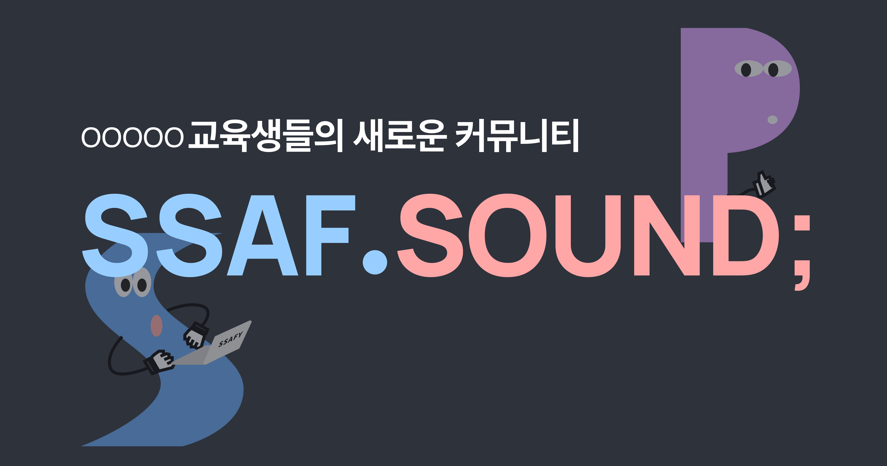

### ~~[SSAF.SOUND 바로가기](https://ssafsound.com)~~ (🥲서버 운영 종료)

 
 
 

## 🏷️ SSAF.SOUND Rest Docs

### [Rest Docs API 명세서 바로 가기](https://ssaf-sound.github.io/ssaf-sound-be/src/main/resources/static/docs/index.html)

 
 
 

## 🙌🏻 Member

Blind 처리

  

## 🏷️ PROJECT GOAL

OOOOO를 희망하는 예비 싸피생부터 재학생 및 수료생들과 현재 교육을 받고 있는 재학생들까지 ❗️
[에브리타임](https://everytime.kr) 을 모티브로 삼아 OOOOO 생활 정보를 간접적으로 경험하고 공유할 수 있으며 '익명' 을 통해 적극적인 커뮤니케이션의 장이 될 수 있도록 기획했습니다.

  

## 🏷️ PROJECT SKILL STACK

        

**Language |** Java 11

**Framework |** Spring Boot 2.7

**Data(RDBMS) |** Spring-Data-JPA 2.7.14, QuertDSL 5.0.0, MySQL 8.0

**Cache |** Redis 2.7.14

**Build Tool |** Gradle

**Test |** Junit 5.8.2, Mockito 4.5.1, JaCoCo 0.8.8

 
 
 
 

## 🏷️ SSAF.SOUND Server Architecture

 
 
 
 

## 🏷️ SSAF.SOUND TROUBLE SHOOTING

Blind 처리
  

